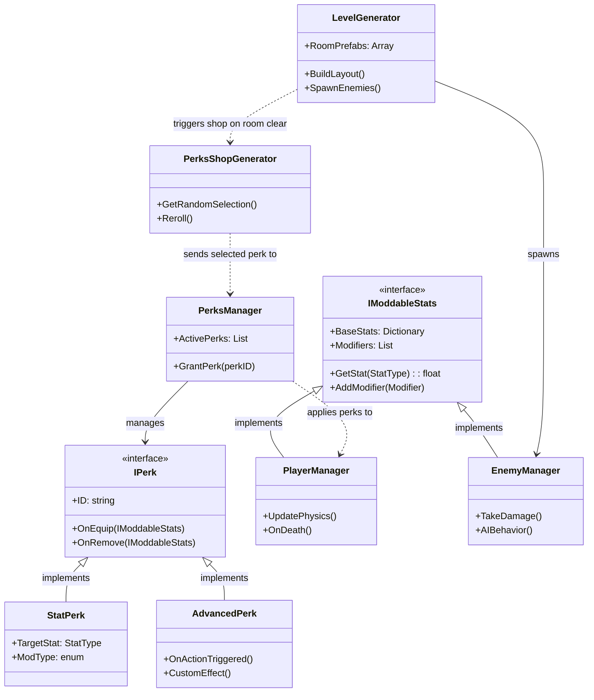

## 1. Core Interfaces

### `IModdableStats`

The contract for any entity that can have its physical or combat properties altered by perks.

* **`Dictionary<StatType, float> BaseStats`**: The "raw" values (e.g., Gravity = 9.8).
* **`Dictionary<StatType, List<Modifier>> Modifiers`**: A collection of active buffs/debuffs.
* **`float GetStat(StatType type)`**: Function to calculate `BaseValue * Mult + Add`.
* **`void AddModifier(StatType type, Modifier mod)`**: Registers a new change.
* **`void RemoveModifier(StatType type, object source)`**: Clears mods from a specific perk.

### `IPerk`

The blueprint for every upgrade in the game.

* **`string ID`**: Unique identifier.
* **`string Title / Description`**: For UI.
* **`void OnEquip(IModdableStats target)`**: Logic triggered when picked up.
* **`void OnRemove(IModdableStats target)`**: Logic for cleaning up modifiers.

---

## 2. Entity Managers

### `PlayerManager` : `IModdableStats`

Handles player-specific logic like input mapping and camera.

* **`UpdatePhysics()`**: Recalculates velocity based on current modded gravity/friction.
* **`OnDeath()`**: Triggers the game-over loop.

### `EnemyManager` : `IModdableStats`

Handles AI behavior and health.

* **`TakeDamage(float amount)`**: Standard health reduction.
* **`AIBehavior()`**: Modular logic (Chase/Shoot) that respects `GetStat(StatType.MoveSpeed)`.

---

## 3. The Perk System

### `PerksManager`

The central registry of what the player currently owns.

* **`List<IPerk> ActivePerks`**: The current build.
* **`void GrantPerk(string perkID)`**: Instantiates and applies a perk to the Player.
* **`void ClearAllPerks()`**: Reset for a new run.

### `StatPerk` : `IPerk`

A simple perk that only changes numbers (e.g., "+20% Speed").

* **`StatType TargetStat`**: Which value to change.
* **`float OperationValue`**: The amount to add or multiply.
* **`ModifierType ModType`**: (Additive vs Multiplicative).

### `AdvancedPerk` : `IPerk`

Perks with complex logic (e.g., "Slo-mo on dash" or "Explode on jump").

* **`virtual void OnActionTriggered(ActionEvent e)`**: Listener for specific game events.
* **`IEnumerator CustomEffect()`**: Coroutines for time-based logic (Slo-mo duration).

---

## 4. World Generation

### `PerksShopGenerator`

Logic for the "Pick 1 of 3" screen.

* **`List<IPerk> GetRandomSelection(int count)`**: Weighted random pull from the master perk list.
* **`void Reroll()`**: Spend "Money" to refresh the list.

### `LevelGenerator`

Handles the procedural "Drunkard's Walk" or Grid-based layout.

* **`Room[] RoomPrefabs`**: Array of hand-crafted modular chunks.
* **`void BuildLayout(int depth)`**: Spawns rooms and connects doorways.
* **`void SpawnEnemies(Room room)`**: Populates the room based on difficulty.

---

## 5. Optional Managers (The "Juice" Layer)

### `SoundManager` (Singleton)

* **`void PlaySfx(string clipName, float pitch = 1.0f)`**: Standard trigger.
* **`void SetTimePitch(float timeScale)`**: Automatically adjusts BGM pitch during Slo-mo perks.

### `EffectsManager`

* **`void PlayVFX(string effectName, Vector3 position)`**: Spawns particles for impacts or perk triggers.
* **`void ScreenShake(float intensity)`**: Purely for game feel.

### `MoneyManager`

* **`int CurrentBalance`**: The player's current run-currency.
* **`bool TryPurchase(int cost)`**: Returns true and deducts if the player can afford a perk.

---

### Implementation Tip: The "Modifier" Class

To avoid math errors, define a helper class for your `IModdableStats`:

```csharp
public class Modifier {
    public float Value;
    public ModifierType Type; // Add, Multiply, Override
    public object Source;     // The Perk that created this
}

```

This allows you to say: "Remove all modifiers where `Source == TripleJumpPerk`," which is much cleaner than trying to manually reverse-engineer a math formula.</StatType,></StatType,>
